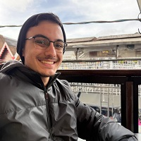
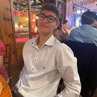

# Currículo Web
Proposto pelo professor Alexandre Sobrino, durante o 2º semetre, módulo de **Fundamentos de Desenvolvimento WEB (FDW)** na **Universidade Santa Cecília (UNISANTA)**.  

## 🧩 Visão Geral

Este projeto tem como objetivo a construção de um currículo online em formato web, permitindo que cada integrante do grupo apresente seu perfil profissional e acadêmico, habilidades, projetos e informações de contato.  

O projeto é voltado para estudo prático de HTML, CSS e boas práticas de desenvolvimento web, com foco em layout, responsividade e organização do código.

## 📂 Possíveis Melhorias
- JavaScript para interatividade;  
- Animações CSS e efeitos visuais;    
- Hospedagem pública (GitHub Pages, Netlify).
  
## 👥 Integrantes do Projeto

  | Ronaldo Brasil Rebouças Filho | Vinicius de Lacerda Rosa e Silva |
  |-------------------------------|---------------------------------|
  |  |  |
